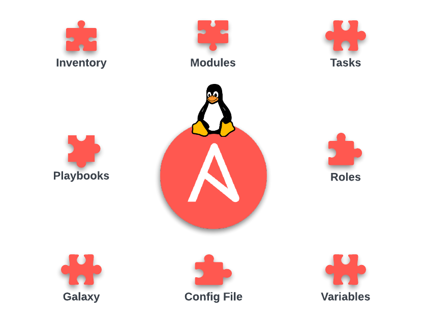
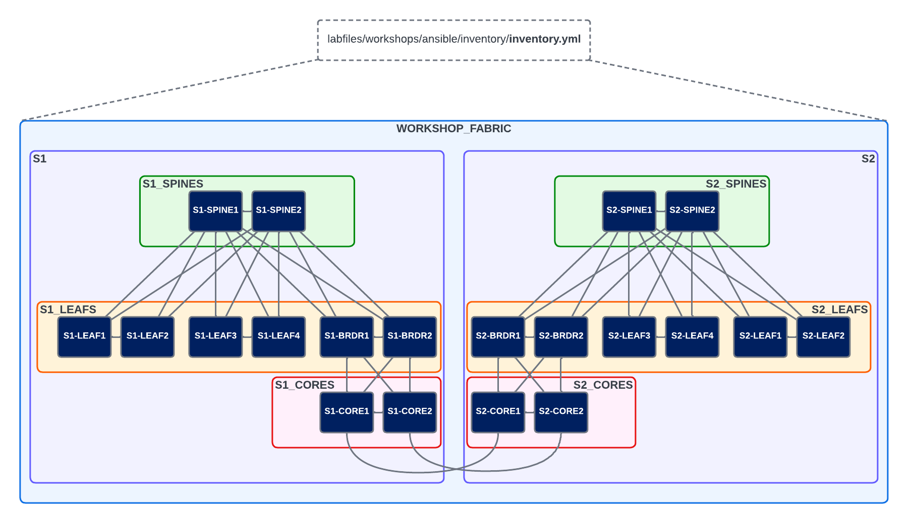
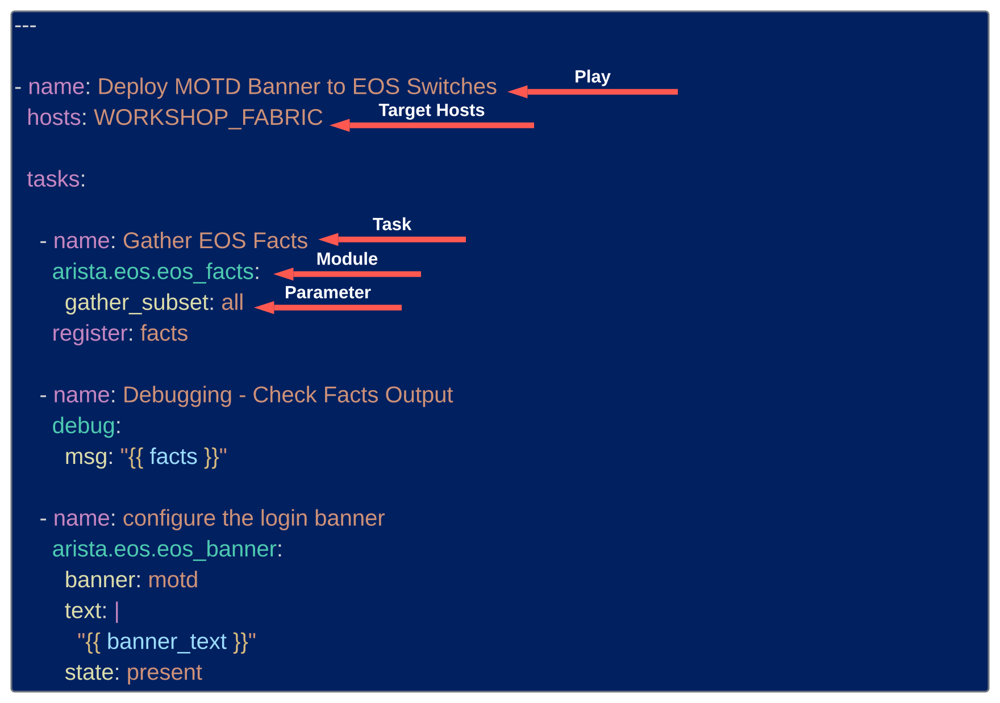
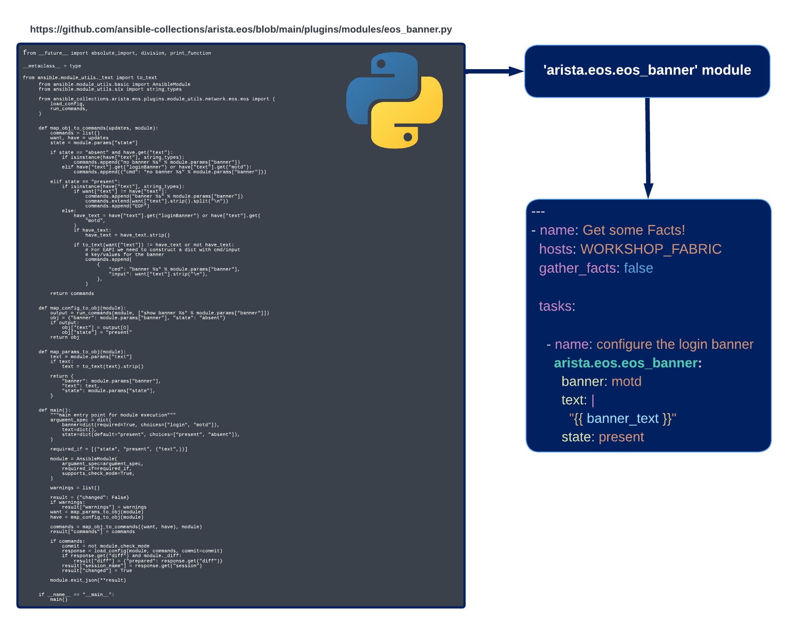
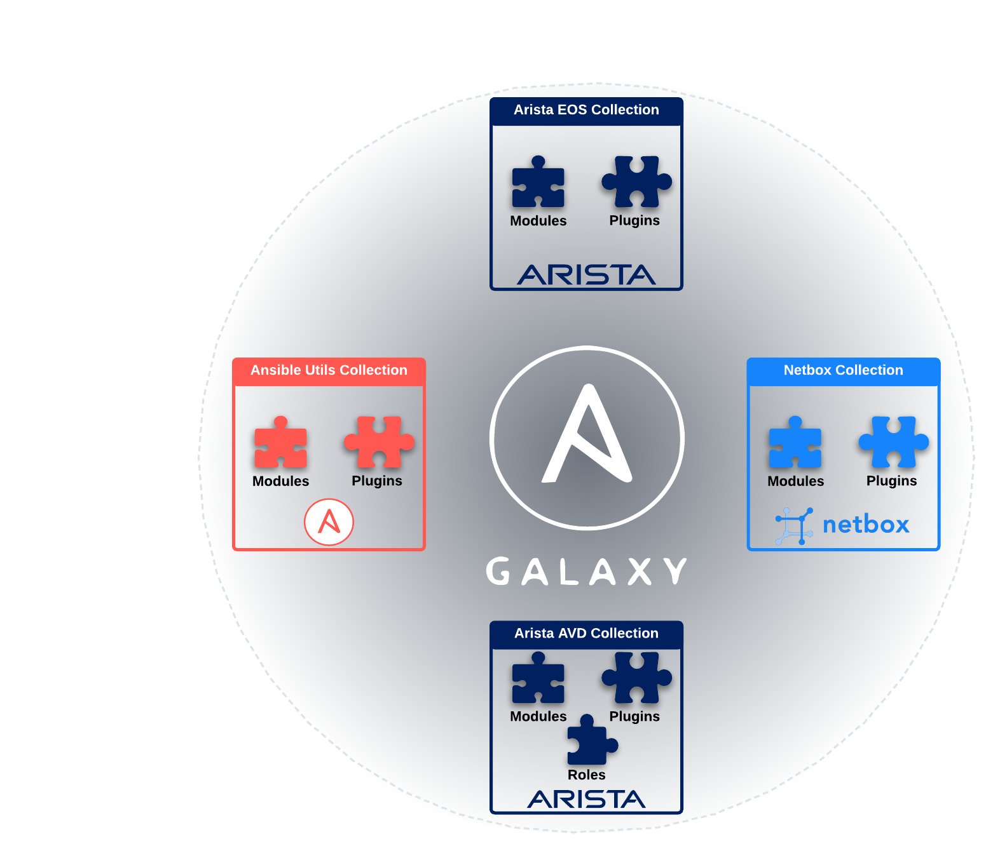

# Welcome to Ansible

{: style="width:800px"}

## What is Ansible

Ansible is a Python-based automation framework. Today, the term "Ansible Automation Platform" can refer to multiple applications, including:

- Ansible Core
- Ansible Galaxy
- Ansible Automation Controller (Previously known as Tower)
- Red Hat Insights

We will be focusing on the first two items during this workshop.

## Why use Ansible

Aside from being "agentless", meaning that Ansible does not require any specialized software on the target hosts, Ansible is also straightforward to get started with. While prior coding or experience in automation is helpful, it is optional to get up and running with Ansible. Playbooks are written in YAML, a language that we'll cover in detail in the [YAML](jinja-yaml.md "Jinja and YAML") section. For now, rest assured that YAML is a human-readable language, which is why it's accessible to start our Ansible journey.

There is an extensive and very active user and development community with Ansible. The project itself is open source, with the GitHub repository available [here](https://github.com/ansible/ansible "Ansible on GitHub"). The popularity of Ansible has led to broad vendor support, spanning multiple technology silos. Network, Compute, Storage, Cloud, Security, and more can all be automated via Ansible.

Finally, all that is required to get started is a Linux host with Python installed. A single Ansible Control Node (ACN) can manage hundreds or thousands of endpoints.

???+ tip "Important Note Before Getting Started"

    This section will make use of the fork of the [Workshops](https://github.com/aristanetworks/ci-workshops-fundamentals.git "Fundamentals Workshop Repo on GitHub") GitHub repository that was
    created during the [Git](git.md) section. If you have not made a fork of this repository and cloned it into the `/home/coder/project/labfiles/` directory of
    your lab environment's VS Code IDE, please do so before moving forward.

## Ansible Initial Setup

There are multiple methods of installing Ansible on the Ansible Control Node. The most popular way is to leverage `pip`, and is covered in detail [here](https://docs.ansible.com/ansible/latest/installation_guide/intro_installation.html "Ansible Installation Documentation").

We will be using `ansible-core`, which is a lightweight minimalist installation of Ansible which does not include extra modules, plugins, etc. With this approach, we can use Ansible Galaxy (covered later in this section) to install collections containing the modules, plugins, and roles we need. For those familiar with Python, think of Ansible Galaxy as [pypi.org](https://pypi.org "Python Packge Index"), and Ansible Collections as Python modules.

???+ note
    Ansible is already installed in the Arista Test Drive lab topology, so we won't need to perform any installation-related tasks.

Below is an example of installing `ansible-core` via pip on Ubuntu 20.04:

```bash
#If necessary, install Python3
sudo apt install update && upgrade
sudo apt install python3 python3-pip --yes

# Install Ansible Core
pip3 install ansible-core
```

It is that easy to get started!

Before running any commands, let's first ensure that we're in the `/home/coder/project/labfiles/ci-workshops-fundamentals/ansible` directory.

```bash
cd ~/project/labfiles/ci-workshops-fundamentals/ansible
```

Next, we'll confirm that Ansible is installed by running the `ansible --version` in the terminal. This should yield output similar to below:

```powershell
ansible [core 2.12.10]
  config file = /home/coder/project/labfiles/ci-workshops-fundamentals/ansible/ansible.cfg
  configured module search path = ['/home/coder/.ansible/plugins/modules', '/usr/share/ansible/plugins/modules']
  ansible python module location = /home/coder/.local/lib/python3.9/site-packages/ansible
  ansible collection location = /home/coder/.ansible/collections
  executable location = /home/coder/.local/bin/ansible
  python version = 3.9.2 (default, Feb 28 2021, 17:03:44) [GCC 10.2.1 20210110]
  jinja version = 3.1.2
  libyaml = True
```

All of the information displayed above is important. It can help troubleshoot why something may not work as expected when working with Ansible.

## Control Node and Managed Nodes


Two important initial terms are the Ansible `Control Node` and `Managed Node`.

The Control Node is where our playbooks are executed from. This Node then connects to the Managed Nodes to interact with them to perform the desired tasks. How the Control Node interacts with the Managed Node depends on the type of operating system running on the Managed Node. For example, suppose the Managed Node is a Linux server. In that case, the Control Node will "ship" the Python code associated with the tasks to the Managed Node. Then, the Managed Node will locally execute that code to complete the tasks.

??? note "What about the lab environment?"
    In our ATD lab environment, the `Control Node` is our JumpHost from which we're running our VS Code IDE.
    The `Managed Nodes` are switches that make up our lab's network topology.

Suppose the Managed Node is a network device. In that case, the Control Node will locally execute the Python code associated with the tasks and then interact with the network devices via SSH or API to complete the tasks.

The Control Node must be a Linux host (Ubuntu, CentOS, Rocky, Debian, etc.) with Ansible installed. That's it! Really! This is part of what makes Ansible easy and efficient to get started with. It does not require a software suite to be installed to get started. A single Control Node can manage hundreds or thousands of Managed Nodes.

A Managed Node does not need any specialized software installed. In other words, Ansible is `agentless`. If a Managed Node is a Linux server, it must have Python3 installed. However, no prerequisites are required for Managed Nodes that are network devices, not even Python. This is because the Control Node will locally execute the Python code necessary to complete the tasks on the network device and will then interact as needed with the network device via SSH/API.

## Ansible Components

Like any other framework, Ansible is made up of a group of components that come together to make the magic happen. The components we'll focus on during this workshop are shown below.



In the next sections, we'll review these components individually to understand of how each piece fits together.

### Config File

The Ansible configuration file is where we set environment variables for our Ansible projects. Many variables can be set in this file, and the most common ones are documented [here](https://docs.ansible.com/ansible/latest/reference_appendices/config.html#common-options "Common Ansible Configuration File Options").

When running an ad-hoc command, or playbook, Ansible will look for the configuration file in the locations listed below. These locations are defined in order of precedence:

1. ANSIBLE_CONFIG (environment variable if set)

2. ansible.cfg (in the current directory)

3. ~/.ansible.cfg (in the home directory)

4. /etc/ansible/ansible.cfg

This is illustrated in the image below:


Once Ansible finds an `ansible.cfg` file, it will only use the configuration options defined in that file. If, for example, an `ansible.cfg` file exists in the current directory and in `/etc/ansible/ansible.cfg`, then only the settings found in the `ansible.cfg` file in the current directory will be used.

??? question "Cows?"

    Yes! First, install cowsay: `sudo apt-get update && sudo apt-get install cowsay -y`
    Next, in the `ansible.cfg` file, set it to what should be the only acceptable setting, `nocows = False`.
    This feature is udderly ridiculous, and as much as I'd love to milk it for all the Dad jokes possible,
    I don't want to start any beef by delaying the workshop...Moo.

Below is an example of the `ansible.cfg` located in our fork of the [Workshops](https://github.com/aristanetworks/ci-workshops-fundamentals.git "Fundamentals Workshop Repo on GitHub") repo:

??? eos-config annotate "Example Ansible Configuration File (~/project/labfiles/ci-workshops-fundamentals/ansible/ansible.cfg)"
    ```apache

    [defaults]

    # Disable host key checking by the underlying tools Ansible uses to connect to target hosts
    host_key_checking = False

    # Location of inventory file containing target hosts
    inventory = ./inventory/inventory.yml

    # Only gather Ansible facts if explicity directed to in a given play
    gathering = explicit

    # Disable the creation of .retry files if a playbook fails
    retry_files_enabled = False

    # Path(s) to search for installed Ansible Galaxy Collections
    collections_paths = ~/.ansible/collections

    # Enable additional Jinja2 Extensions (https://jinja.palletsprojects.com/en/3.1.x/extensions/)
    jinja2_extensions =  jinja2.ext.loopcontrols,jinja2.ext.do,jinja2.ext.i18n

    # Enable the YAML callback plugin, providing much easier to read terminal output. (https://docs.ansible.com/ansible/latest/plugins/callback.html#callback-plugins)
    stdout_callback = yaml

    # Permit the use of callback plugins when running ad-hoc commands
    bin_ansible_callbacks = True

    # List of enabled callbacks. Many callbacks shipped with Ansible are not enabled by default
    callback_whitelist = profile_roles, profile_tasks, timer

    # Maximum number of forks that Ansible will use to execute tasks on target hosts
    forks = 15

    # Disable cowsay (Why?)
    nocows = True

    [paramiko_connection]
    # Automatically add the keys of target hosts to known hosts
    host_key_auto_add = True

    [persistent_connection]
    # Set the amount of time, in seconds, to wait for response from remote device before timing out persistent connection.
    command_timeout = 60

    # Set the amount of time, in seconds, that a persistent connection will remain idle before it is destroyed.
    connect_timeout = 60

    ```

One of the most common settings in the ansible.cfg file is the location of the `inventory` file, which we will discuss next.

### Inventory

In the inventory file, we define the hosts and groups we'll target with our playbooks. The inventory file supports many formats, but the most common are `ini` and `yaml`. For our workshop, we'll be using the `yaml` format.

An example of our inventory file can be seen below:

??? eos-config annotate "Example Inventory File (~project/labfiles/ci-workshops-fundamentals/ansible/inventory/inventory.yml)"
    ```yaml
    WORKSHOP_FABRIC:
      children:
        S1:
          children:
            S1_SPINES:
              hosts:
                s1-spine1:
                s1-spine2:
            S1_LEAFS:
              hosts:
                s1-leaf1:
                s1-leaf2:
                s1-leaf3:
                s1-leaf4:
                s1-brdr1:
                s1-brdr2:
                s1-core1:
                s1-core2:
        S2:
          children:
            S2_SPINES:
              hosts:
                s2-spine1:
                s2-spine2:
            S2_LEAFS:
              hosts:
                s2-leaf1:
                s2-leaf2:
                s2-leaf3:
                s2-leaf4:
                s2-brdr1:
                s2-brdr2:
                s2-core1:
                s2-core2:

    ```

This inventory file defines the hosts and groupings, represented in the image below:



We can validate our inventory by using the `ansible-inventory` command, which is documented [here](https://docs.ansible.com/ansible/latest/network/getting_started/first_inventory.html#verifying-the-inventory "Verifying Ansible Inventory").

The below command will list the entire inventory, consisting of all hosts/groups and their respective variable values.

!!! warning "Reminder"
    Ensure all commands are run from the `/home/coder/project/labfiles/ci-workshops-fundamentals/ansible` directory in the terminal on the ATD VS Code IDE instance.

```bash
ansible-inventory --list --yaml
```

If we'd like to get more specific, we can filter the output down to a single host by using the command shown below:

```bash
ansible-inventory --host s1-leaf1 --yaml
```

??? eos-config annotate "Example inventory output for s1-leaf1"
    ```yaml
    ansible_connection: ansible.netcommon.httpapi
    ansible_httpapi_use_ssl: true
    ansible_httpapi_validate_certs: false
    ansible_network_os: arista.eos.eos
    ansible_ssh_pass: arista1c7z
    ansible_user: arista
    banner_text: This banner came from host_vars/s1-leaf1.YML
    mlag:
      enabled: true
      peer_link_int_1: 1
      peer_link_int_2: 6
      side_a: true
    mlag_config:
      domain_id: 1000
      peer_link_id: 1000
      side_a:
        ip: 10.0.0.1/30
        peer_ip: 10.0.0.2
      side_b:
        ip: 10.0.0.2/30
        peer_ip: 10.0.0.1
      vlan:
        id: 4094
        name: mlagpeer
        trunk_group_name: mlagpeer

    ```

Notice the variables associated with `s1-leaf1`. Where did these come from? We'll be exploring that next...

### Variables

We can define variables in many locations with Ansible. For example, we can explicitly define a variable when running a playbook by using the `extra-vars` flag.

```bash
ansible-playbook playbooks/hello_world.yml -e 'name=Mitch'
```

The contents of the playbook we just ran can be seen below. We will look more into the anatomy of a playbook in our next section. For now, note that the `name` variable is also set in the `hello-world.yml` playbook
using the `vars` parameter. When we ran our playbook with `extra_vars`, this took precedence over the variable defined inside the playbook.

??? eos-config annotate "hello_world.yml Playbook (~/project/labfiles/ci-workshops-fundamentals/ansible/playbooks/hello_world.yml)"
    ```yaml

    ---

    - name: A simple playbook
      hosts: localhost
      gather_facts: false
      vars:
        name: Mr.T

      tasks:

        - name: Say Hello
          debug:
            msg: "Hello {{ name | default('you!') }}"

    ```

Other valid locations for variables, and their respective precedence, are shown in the diagram below:


As can be expected, there are a LOT of places where we can define variables. Each option has its use case, but the general recommendation is to use ==host_vars== and ==group_vars== as much as possible.

Inside our `~/project/labfiles/ci-workshops-fundamentals/ansible/inventory` directory, is a `host_vars` and `group_vars` directory. These are special directories that Ansible will use to establish a hierarchy of variables
that maps directly to our inventory hosts and group structure. Each group can have a dedicated `yaml` file, as can each host. A visual representation of this can be seen below:


In the example above, if we were to define a variable in the `~/project/labfiles/ci-workshops-fundamentals/ansible/inventory/group_vars/WORKSHOP_FABRIC.yml` file, then all Managed Nodes contained within that group in our inventory file would inherit that variable. The contents of our `WORKSHOP_FABRIC.yml` file can be seen below:

??? eos-config annotate "WORKSHOP_FABRIC.yml (~/project/labfiles/ci-workshops-fundamentals/ansible/inventory/group_vars/WORKSHOP_FABRIC.yml)"
    ```yaml

    # eAPI connectivity via HTTPS (as opposed to CLI via SSH)
    ansible_connection: ansible.netcommon.httpapi

    # Specifies that we are using Arista EOS
    ansible_network_os: arista.eos.eos

    # Use SSL (HTTPS)
    ansible_httpapi_use_ssl: true

    # Disable SSL certificate validation
    ansible_httpapi_validate_certs: false

    # Credentials
    ansible_user: arista
    ansible_ssh_pass: arista1c7z

    # Global login banner for all switches in topology
    banner_text: "This banner came from group_vars/WORKSHOP_FABRIC.YML"

    ```

These values will all be inherited by the nodes in the `WORKSHOP_FABRIC` group defined in our inventory file.

We can verify this by running `ansible-inventory --host s2-spine1 --yaml`.

```bash
ansible-inventory --host s2-spine1 --yaml
```

??? eos-config annotate "Output of 'ansible-inventory --host s2-spine1 --yaml'"
    ```yaml

    ansible_connection: ansible.netcommon.httpapi
    ansible_httpapi_use_ssl: true
    ansible_httpapi_validate_certs: false
    ansible_network_os: arista.eos.eos
    ansible_ssh_pass: YourLabPasswordHere
    ansible_user: arista
    banner_text: This banner came from group_vars/WORKSHOP_FABRIC.YML

    ```

And there they are! All of the variables we had defined in `WORKSHOP_FABRIC.yml` are present.

If we run this same command but specify `s1-leaf3`, we'll see some additional and slightly different variables:

```bash
ansible-inventory --host s1-leaf3 --yaml
```

??? eos-config annotate "Output of 'ansible-inventory --host s1-leaf3 --yaml'"
    ```yaml

    ansible_connection: ansible.netcommon.httpapi
    ansible_httpapi_use_ssl: true
    ansible_httpapi_validate_certs: false
    ansible_network_os: arista.eos.eos
    ansible_ssh_pass: arista1c7z
    ansible_user: arista
    banner_text: This banner came from group_vars/S1.YML
    mlag_config:
      domain_id: 1000
      peer_link_id: 1000
      side_a:
        ip: 10.0.0.1/30
        peer_ip: 10.0.0.2
      side_b:
        ip: 10.0.0.2/30
        peer_ip: 10.0.0.1
      vlan:
        id: 4094
        name: mlagpeer
        trunk_group_name: mlagpeer

    ```

Whoa! There is certainly more there...and looking at `banner_text`, we can see that it's different. With `group_vars`, the closer to the host we get, the higher the precedence of the variable. So, in the case of `banner_text`, it is defined
in `WORKSHOP_FABRIC.yml` and `S1.yml`. Because the `S1` group is closer to the host (`s1-leaf3`) in this case, the `banner_text` variable defined in `S1.yml` take priority.

??? eos-config annotate "S1.yml (~/project/labfiles/ci-workshops-fundamentals/ansible/inventory/group_vars/S1.yml)"
    ```yaml

    mlag_config:
      domain_id: 1000
      vlan:
        id: 4094
        name: mlagpeer
        trunk_group_name: mlagpeer
      peer_link_id: 1000
      side_a:
        ip: 10.0.0.1/30
        peer_ip: 10.0.0.2
      side_b:
        ip: 10.0.0.2/30
        peer_ip: 10.0.0.1

    banner_text: "This banner came from group_vars/S1.YML"

    ```

We'll use the `mlag_config` stuff later. Let's focus on the `banner_text` variable for now.

Finally, let's take a look at the effective variables on `s1-leaf1`.

```bash
ansible-inventory --host s1-leaf1 --yaml
```

??? eos-config annotate "Output of 'ansible-inventory --host s1-leaf1 --yaml'"
    ```yaml

    ansible_connection: ansible.netcommon.httpapi
    ansible_httpapi_use_ssl: true
    ansible_httpapi_validate_certs: false
    ansible_network_os: arista.eos.eos
    ansible_ssh_pass: YourLabPasswordHere
    ansible_user: arista
    banner_text: This banner came from host_vars/s1-leaf1.YML
    mlag:
      enabled: true
      peer_link_int_1: 1
      peer_link_int_2: 6
      side_a: true
    mlag_config:
      domain_id: 1000
      peer_link_id: 1000
      side_a:
        ip: 10.0.0.1/30
        peer_ip: 10.0.0.2
      side_b:
        ip: 10.0.0.2/30
        peer_ip: 10.0.0.1
      vlan:
        id: 4094
        name: mlagpeer
        trunk_group_name: mlagpeer

    ```

Notice we now have a few more variables, namely the `mlag` dictionary. We also can see that the `banner_text` has changed yet again. This time due to the fact that this variable is defined in
`~/project/labfiles/ci-workshops-fundamentals/ansible/inventory/host_vars/s1-leaf1.yml`. This demonstrates that a variable defined in `host_vars` will take priority over the same variable defined in `group_vars`.

??? eos-config annotate "s1-leaf1.yml (~/project/labfiles/ci-workshops-fundamentals/ansible/inventory/host_vars/s1-leaf1.yml)"
    ```yaml

    mlag_config:
      domain_id: 1000
      vlan:
        id: 4094
        name: mlagpeer
        trunk_group_name: mlagpeer
      peer_link_id: 1000
      side_a:
        ip: 10.0.0.1/30
        peer_ip: 10.0.0.2
      side_b:
        ip: 10.0.0.2/30
        peer_ip: 10.0.0.1

    banner_text: "This banner came from group_vars/S1.YML"

    ```

Next, let's use a playbook to deploy our "Message of the Day" banner to all of the switches in our lab!

### Playbooks

Ansible Playbooks are written in YAML and typically consist of four main components:

- Plays
- Tasks
- Modules
- Module Parameters

Other items such as variables, conditionals, tags, comments, and more are also available tools for us. But, we will focus on the four main components for our discussion.

To do this, we'll review a playbook together. Specifically, the **`~/project/labfiles/ci-workshops-fundamentals/ansible/playbooks/deploy_banner.yml`** in our lab environment.



At the start of our playbook, we have the ==Play== which is the very root of the playbook. At the beginning of the play is where we define the Managed Nodes we'd like to target with this play, as well as the list of tasks we'd like to run on these ==target hosts==.

Next, we have the ==task== itself, leveraging the **eos_facts** ==module== to gather information about the Managed Nodes (devices running Arista's EOS in our topology).
In a minute, we'll unpack what a module is behind the scenes.

Finally, we have any ==parameters== associated with a module. Some of these parameters may be required, while others may be optional. The best way to learn about a module is to find its documentation out on [Ansible Galaxy](https://galaxy.ansible.com/ "Ansible Galaxy") by searching for it. For example, when we search for `eos_` on Ansible Galaxy, we get the output below:


34 Modules, one of which is the `eos_banner` module, with all its associated documentation!

More on Ansible Galaxy in a bit...

???+ warning "Configure Your Lab Password"
    Update `WORKSHOP_FABRIC.yml` at the line `ansible_ssh_pass` with your specific lab password otherwise Ansible playbook runs will error out. (~/project/labfiles/ci-workshops-fundamentals/ansible/inventory/group_vars/WORKSHOP_FABRIC.yml)

Let's go ahead and run our playbook! Bonus points if cowsay is enabled.

```bash
ansible-playbook playbooks/deploy_banner.yml
```

Alright! Let's hop into our switches and see what happened...

#### s2-spine1

```txt
"This banner came from group_vars/WORKSHOP_FABRIC.yml"
s2-spine1#
```

#### s1-spine1

```txt
"This banner came from group_vars/S1.yml"
s1-spine1#
```

#### s1-leaf1

```txt
"This banner came from host_vars/s1-leaf1.yml"
s1-leaf1#
```

As expected, each device used whichever `banner_text` variable was closest to it in the group hierarchy. Or in the case of s1-leaf1, `banner_text` was applied via its `host_vars` file.

### Modules

When we ran our playbook, one of the key components was the ==module==. In our case, this was the [eos_banner module](https://github.com/ansible-collections/arista.eos/blob/main/docs/arista.eos.eos_banner_module.rst "eos_banner Module Documentation").

But what is this module doing behind the scenes? Why are modules such a key piece of what makes Ansible much easier to start with than other Automation Frameworks?

Modules are an abstraction of the Python code necessary to complete a given task, or tasks, associated with the module. In other words, behind the scenes, modules are just Python code!

An example of this can be seen below, specifically for the [eos_banner module](https://github.com/ansible-collections/arista.eos/blob/main/plugins/modules/eos_banner.py "eos_banner module python code"):



It's a lot easier to call `eos_banner` in a playbook than it is to write, in a reusable fashion, all of that Python code! The abstraction of the detailed "behind the scenes" code is why modules are such as big reason Ansible is easy to get started with.

Now, if we feel compelled to dive in and write our own modules, or our own roles/collections/plugins, we can certainly do this. Ansible is very extensible in this manner. When we're finished developing our content, if we want to share it with the world, then we can publish it as a Collection on [Ansible Galaxy!](https://galaxy.ansible.com "Ansible Galaxy").

### Ansible Galaxy

Earlier, we specified that we were using `ansible-core` for this workshop. This approach, instead of installing `ansible`, is becoming increasingly preferred. The reason for this is the efficiency of `ansible-core`; it is a lightweight minimalist installation of Ansible without any extra modules, roles, plugins, etc., natively included.

With `ansible-core`, we can only grab the modules, roles, plugins, etc. that we need from [Ansible Galaxy!](https://galaxy.ansible.com "Ansible Galaxy").

{: style="width:800px"}

For example, if we want to install the [Arista EOS Ansible Collection](https://galaxy.ansible.com/arista/eos "Arista EOS Collection"), we can enter the following command in our terminal

```bash
ansible-galaxy collection install arista.eos
```

Once completed, we can validate that the collection has been installed by running the command below:

```bash
ansible-galaxy collection list
```

???+ info
    The `ansible-galaxy collection list` command is supported in Ansible 2.10+

This will yield output similar to below:

??? eos-config annotate "Ansible Galaxy Collection List"
    ```powershell

    # /home/coder/.ansible/collections/ansible_collections
    Collection        Version
    ----------------- -------
    ansible.netcommon 7.0.0
    ansible.posix     1.5.4
    ansible.utils     5.0.0
    arista.avd        4.10.0
    arista.cvp        3.10.1
    arista.eos        10.0.0
    community.general 6.5.0

    ```

Note the line in the output `/home/coder/.ansible/collections/ansible_collections`...how did Ansible know to look here? The answer: The `ansible.cfg` file!

Specifically, this parameter:

```yaml
# Path(s) to search for installed Ansible Galaxy Collections
collections_paths = ~/.ansible/collections
```

Galaxy has thousands of modules, plugins, roles, and more from many community members.

For those familiar with Python, we can think of Ansible Galaxy as [PyPi](https://www.pypi.org "Python Package Index"), and our Collections as Python modules.

Go forth and explore!

### Ansible Roles


Ansible roles allow us to neatly pack all of the tasks, templates, files, etc., that we use to accomplish a task into a nice reusable format. An example of this could be a standardized method for installing NGINX or Apache on a server. Or, as we'll see in our labs, deploying an MLAG domain configuration on Arista switches.

Ultimately, Ansible Roles can be seen as a blueprint to automate and standardize our repeatable tasks.
