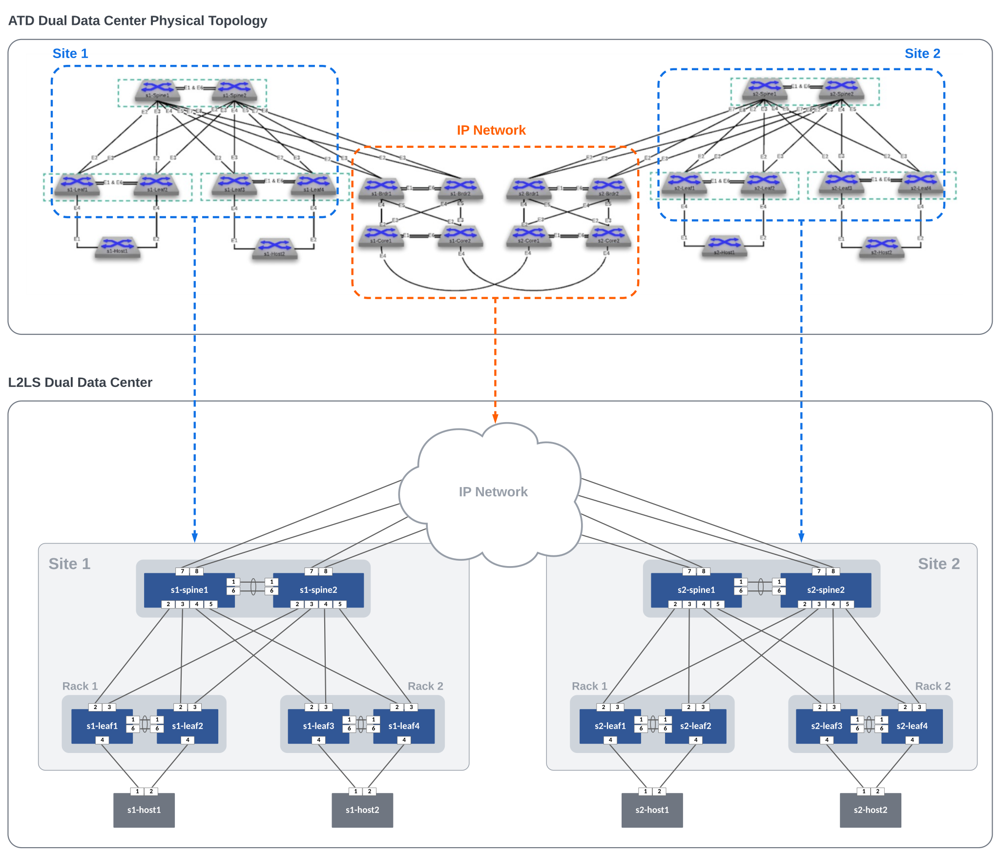
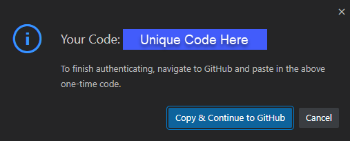
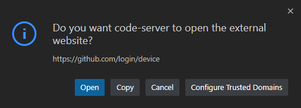
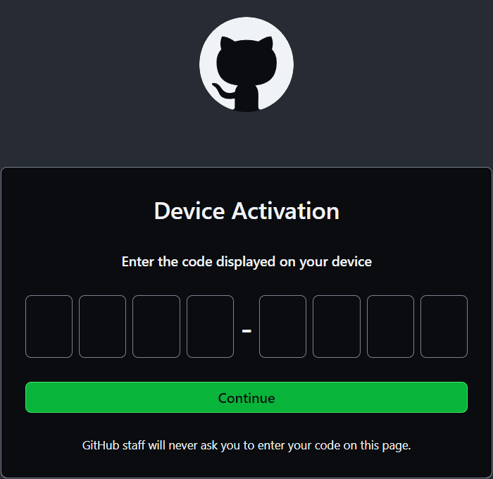
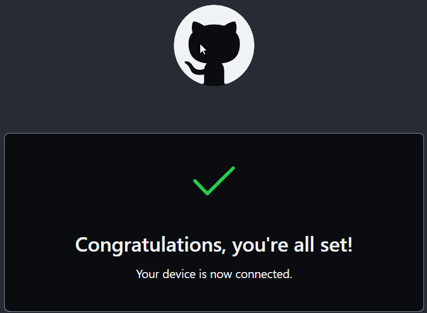

# AVD Lab Guide

## AVD Lab Guide Overview

The AVD Lab Guide is a follow-along set of instructions to deploy a dual data center L2LS fabric design. The data model overview and details can be found [here](avd.md). In the following steps, we will explore updating the data models to add services, ports, and WAN links to our fabrics and test traffic between sites.

In this example, the ATD lab is used to create the L2LS Dual Data Center topology below. The IP Network cloud (orange area) is pre-provisioned and is comprised of the border and core nodes in the ATD topology. Our focus will be creating the L2LS AVD data models to build and deploy configurations for Site 1 and Site 2 (blue areas) and connect them to the IP Network.



### Host Addresses

| Host     |  IP Address  |
|:--------:|:------------:|
| s1-host1 | 10.10.10.100 |
| s1-host2 | 10.20.20.100 |
| s2-host1 | 10.30.30.100 |
| s2-host2 | 10.40.40.100 |

## **Step 1 - Prepare Lab Environment**

### Access the ATD Lab

Connect to your ATD Lab and start the Programmability IDE. Next, create a new Terminal.

### Fork and Clone branch to ATD Lab

An ATD Dual Data Center L2LS data model is posted on [GitHub](https://github.com/aristanetworks/ci-workshops-avd).

- Fork this **[repository](https://github.com/aristanetworks/ci-workshops-avd)** to your own GitHub account.
- Next, clone your forked repo to your ATD lab instance.

``` bash
cd /home/coder/project/labfiles
```

``` bash
git clone <your copied URL>
```

``` bash
cd ci-workshops-avd
```

Configure your global Git settings.

``` bash
git config --global user.name "FirstName LastName"
```

``` bash
git config --global user.email "name@example.com"
```

### Update AVD

AVD has been pre-installed in your lab environment. However, it may be on an older version (in some cases a newer version). The following steps will update AVD and modules to the valid versions for the lab.

``` bash
pip3 config set global.disable-pip-version-check true
pip3 install "ansible-core==2.15.5"
ansible-galaxy collection install -r requirements.yml
export ARISTA_AVD_DIR=$(ansible-galaxy collection list arista.avd --format yaml | head -1 | cut -d: -f1)
pip3 install -r ${ARISTA_AVD_DIR}/arista/avd/requirements.txt
```

???+ Warning "Important"

    You must run these commands when you start your lab or a new shell (terminal).

### Setup Lab Password Environment Variable

Each lab comes with a unique password. We set an environment variable called `LABPASSPHRASE` with the following command. The variable is later used to generate local user passwords and connect to our switches to push configs.

``` bash
export LABPASSPHRASE=`cat /home/coder/.config/code-server/config.yaml| grep "password:" | awk '{print $2}'`
```

You can view the password is set. This is the same password displayed when you click the link to access your lab.

``` bash
echo $LABPASSPHRASE
```

???+ Warning "IMPORTANT"

    You must run this step when you start your lab or a new shell (terminal).

### Prepare WAN IP Network and Test Hosts

The last step in preparing your lab is to push pre-defined configurations to the WAN IP Network (cloud) and the four hosts used to test traffic. The spines from each site will connect to the WAN IP Network with P2P links. The hosts (two per site) have port-channels to the leaf pairs and are pre-configured with an IP address and route to reach the other hosts.

Run the following to push the configs.

``` bash
make preplab
```

## **Step 2 - Build and Deploy Dual Data Center L2LS Network**

This section will review and update the existing L2LS data model. We will add features to enable VLANs, SVIs, connected endpoints, and P2P links to the WAN IP Network. After the lab, you will have enabled an L2LS dual data center network through automation with AVD. YAML data models and Ansible playbooks will be used to generate EOS CLI configurations and deploy them to each site. We will start by focusing on building out Site 1 and then repeat similar steps for Site 2. Finally, we will enable connectivity to the WAN IP Network to allow traffic to pass between sites.

### **Summary of Steps**

1. Build and Deploy `Site 1`
2. Build and Deploy `Site 2`
3. Connect sites to WAN IP Network
4. Verify routing
5. Test traffic

## **Step 3 - Site 1**

### Build and Deploy Initial Fabric

The initial fabric data model key/value pairs have been pre-populated in the following group_vars files in the `sites/site_1/group_vars/` directory.

- SITE1_FABRIC_PORTS.yml
- SITE1_FABRIC_SERVICES.yml
- SITE1_FABRIC.yml
- SITE1_LEAFS.yml
- SITE1_SPINES.yml

Review these files to understand how they relate to the topology above.

At this point, we can build and deploy our initial configurations to the topology.

``` bash
make build-site-1
```

AVD creates a separate markdown and EOS configuration file per switch. In addition, you can review the files in the `documentation` and `intended` folders per site.

{: style="width:300px"}

Now, deploy the configurations to Site 1 switches.

``` bash
make deploy-site-1
```

Login to your switches to verify the current configs (`show run`) match the ones created in `intended/configs` folder.

You can also check the current state for MLAG, VLANs, interfaces, and port-channels.

``` bash
show mlag
```

``` bash
show vlan brief
```

``` bash
show ip interface brief
```

``` bash
show port-channel
```

The basic fabric with MLAG peers and port-channels between leaf and spines are now created. Next up, we will add VLAN and SVI services to the fabric.

### Add Services to the Fabric

The next step is to add Vlans and SVIs to the fabric. The services data model file `SITE1_FABRIC_SERVICES.yml` is pre-populated with Vlans and SVIs `10` and `20` in the default VRF.

Open `SITE1_FABRIC_SERVICES.yml` and uncomment lines 1-28, then run the build & deploy process again.

???+ tip
    :writing_hand: In VS Code, you can toggle comments on/off by selecting the text and pressing ***windows*** ++ctrl++ + ++slash++ or ***mac*** ++cmd++ + ++slash++.

``` bash
make build-site-1
```

``` bash
make deploy-site-1
```

Log into `s1-spine1` and `s1-spine2` and verify the SVIs `10` and `20` exist.

``` bash
show ip interface brief
```

It should look similar to the following:

``` text
                                           Address
Interface         IP Address            Status       Protocol            MTU    Owner
----------------- --------------------- ------------ -------------- ----------- -------
Loopback0         10.1.252.1/32         up           up                65535
Management0       192.168.0.10/24       up           up                 1500
Vlan10            10.10.10.2/24         up           up                 1500
Vlan20            10.20.20.2/24         up           up                 1500
Vlan4093          10.1.254.0/31         up           up                 1500
Vlan4094          10.1.253.0/31         up           up                 1500
```

You can verify the recent configuration session was created.

???+ info
    When the configuration is applied via a configuration session, EOS will create a "checkpoint" of the configuration. This checkpoint is a snapshot
    of the device's running configuration as it was **prior** to the configuration session being committed.

``` bash
show clock
```

``` bash
show configuration sessions detail
```

List the recent checkpoints.

``` bash
show config checkpoints
```

View the contents of the latest checkpoint file.

``` bash
more checkpoint:< filename >
```

See the difference between the running config and the latest checkpoint file.

???+ tip
    This will show the differences between the current device configuration
    and the configuration before we did our `make deploy` command.

``` bash
diff checkpoint:< filename > running-config
```

### Add Ports for Hosts

Let's configure port-channels to our hosts (`s1-host1` and `s1-host2`).

Open `SITE1_FABRIC_PORTS.yml` and uncomment lines 17-45, then run the build & deploy process again.

``` bash
make build-site-1
```

``` bash
make deploy-site-1
```

At this point, hosts should be able to ping each other across the fabric.

From `s1-host1`, run a ping to `s1-host2`.

``` bash
ping 10.20.20.100
```

``` text
PING 10.20.20.100 (10.20.20.100) 72(100) bytes of data.
80 bytes from 10.20.20.100: icmp_seq=1 ttl=63 time=30.2 ms
80 bytes from 10.20.20.100: icmp_seq=2 ttl=63 time=29.5 ms
80 bytes from 10.20.20.100: icmp_seq=3 ttl=63 time=28.8 ms
80 bytes from 10.20.20.100: icmp_seq=4 ttl=63 time=24.8 ms
80 bytes from 10.20.20.100: icmp_seq=5 ttl=63 time=26.2 ms
```

Site 1 fabric is now complete.

## **Step 4 - Site 2**

Repeat the previous three steps for Site 2.

- Add Services
- Add Ports
- Build and Deploy Configs
- Verify ping traffic between hosts `s2-host1` and `s2-host2`

At this point, you should be able to ping between hosts within a site but not between sites. For this, we need to build connectivity to the `WAN IP Network`. This is covered in the next section.

## **Step 5 - Connect Sites to WAN IP Network**

The WAN IP Network is defined by the `core_interfaces` data model. Full data model documentation is located **[here](https://avd.arista.com/4.1/roles/eos_designs/docs/tables/core-interfaces.html?h=core+interfaces)**.

The data model defines P2P links (`/31s`) on the spines with a stanza per link. See details in the graphic below. Each spine has two links to the WAN IP Network configured on ports `Ethernet7` and `Ethernet8`. OSPF is added to these links as well.


### **Add P2P Links to WAN IP Network for Site 1 and 2**

Add each site's `core_interfaces` dictionary (shown below) to the bottom of the following files `SITE1_FABRIC.yml` and `SITE2_FABRIC.yml`

### **Site #1**

Add the following code block to the bottom of `sites/site_1/group_vars/SITE1_FABRIC.yml`.

``` yaml
##################################################################
# WAN/Core Edge Links
##################################################################

core_interfaces:
  p2p_links:

    - ip: [ 10.0.0.29/31, 10.0.0.28/31 ]
      nodes: [ s1-spine1, WANCORE ]
      interfaces: [ Ethernet7, Ethernet2 ]
      include_in_underlay_protocol: true

    - ip: [ 10.0.0.33/31, 10.0.0.32/31 ]
      nodes: [ s1-spine1, WANCORE ]
      interfaces: [ Ethernet8, Ethernet2 ]
      include_in_underlay_protocol: true

    - ip: [ 10.0.0.31/31, 10.0.0.30/31 ]
      nodes: [ s1-spine2, WANCORE ]
      interfaces: [ Ethernet7, Ethernet2 ]
      include_in_underlay_protocol: true

    - ip: [ 10.0.0.35/31, 10.0.0.34/31 ]
      nodes: [ s1-spine2, WANCORE ]
      interfaces: [ Ethernet8, Ethernet2 ]
      include_in_underlay_protocol: true
```

### **Site #2**

Add the following code block to the bottom of `sites/site_2/group_vars/SITE2_FABRIC.yml`.

``` yaml
##################################################################
# WAN/Core Edge Links
##################################################################

core_interfaces:
  p2p_links:

    - ip: [ 10.0.0.37/31, 10.0.0.36/31 ]
      nodes: [ s2-spine1, WANCORE ]
      interfaces: [ Ethernet7, Ethernet2 ]
      include_in_underlay_protocol: true

    - ip: [ 10.0.0.41/31, 10.0.0.40/31 ]
      nodes: [ s2-spine1, WANCORE ]
      interfaces: [ Ethernet8, Ethernet2 ]
      include_in_underlay_protocol: true

    - ip: [ 10.0.0.39/31, 10.0.0.38/31 ]
      nodes: [ s2-spine2, WANCORE ]
      interfaces: [ Ethernet7, Ethernet2 ]
      include_in_underlay_protocol: true

    - ip: [ 10.0.0.43/31, 10.0.0.42/31 ]
      nodes: [ s2-spine2, WANCORE ]
      interfaces: [ Ethernet8, Ethernet2 ]
      include_in_underlay_protocol: true
```

### **Build and Deploy WAN IP Network connectivity**

``` bash
make build-site-1 build-site-2 deploy-site-1 deploy-site-2
```

???+ tip
    Daisy chaining "Makesies" is a great way to run a series of tasks with a single CLI command :grinning:

### **Check routes on spine nodes**

From the spines, verify that they can see routes to the following networks where the hosts reside.

- 10.10.10.0/24
- 10.20.20.0/24
- 10.30.30.0/24
- 10.40.40.0/24

``` bash
show ip route
```

### **Test traffic between sites**

From `s1-host1` ping both `s2-host1` & `s2-host2`.

``` bash
# s2-host1
ping 10.30.30.100
```

``` bash
# s2-host2
ping 10.40.40.100
```

## **Congratulations!**

You have built a multi-site L2LS network without touching the CLI on a single switch.

## **Step 6 - Day 2 Operations**

Our multi-site L2LS network is working great. But, before too long, it will be time to change
our configurations. Lucky for us, that time is today!

### **Cleaning Up**

Before going any further, let's ensure we have a clean repo by committing the changes we've made
up to this point. The CLI commands below can accomplish this, but the VS Code Source Control GUI
can be used as well.

```bash
git add .
git commit -m 'Your message here'
```

Next, we'll want to push these changes to our forked repository on GitHub.

```bash
git push
```

If this is our first time pushing to our forked repository, then VS Code will provide us with the following
sign-in prompt:

{: style="width:400px"}

Choose **Allow**, and another prompt will come up, showing your unique login code:

{: style="width:400px"}

Choose **Copy & Continue to GitHub**, and *another* prompt will come up asking if it's ok to open an external website (GitHub).

{: style="width:400px"}

Choose **Open** and then an external site (GitHub) will open, asking for your login code.

{: style="width:400px"}

Paste in your login code and choose **Continue**. You will then be prompted to Authorize VS Code.

{: style="width:400px"}

Choose **Authorize Visual-Studio-Code**, and you should be presented with the coveted Green Check Mark!

{: style="width:400px"}

Whew! Alright. Now that we have that complete, let's keep moving...

### **Branching Out**

Before jumping in and modifying our files, we'll create a branch named **banner-syslog** in our
forked repository to work on our changes. We can create our branch in multiple ways, but we'll use
the `git switch` command with the `-c` parameter to create our new branch.

```bash
git switch -c banner-syslog
```

After entering this command, we should see our new branch name reflected in the terminal. It will also be
reflected in the status bar in the lower left-hand corner of our VS Code window (you may need to click the refresh icon
before this is shown).

Now we're ready to start working on our changes :sunglasses:.

### **Login Banner**

When we initially deployed our multi-site topology, we should have included a login banner on all our switches.
Let's take a look at the **[AVD documentation site](https://avd.arista.com/4.1/roles/eos_cli_config_gen/docs/tables/banners.html?h=banners)** to see what the
data model is for this configuration.

The banner on all of our switches will be the same. After reviewing the AVD documentation, we know we can accomplish this by defining the `banners` input variable
in our `global_vars/global_dc_vars.yml` file.

Add the code block below to `global_vars/global_dc_vars.yml`.

```yaml
# Login Banner
banners:
  motd: |
    You shall not pass. Unless you are authorized. Then you shall pass.
    EOF
```

???+ danger "Yes, that "EOF" is important!"
    Ensure the entire code snippet above is copied; including the `EOF`. This must be present for the configuration to be
    considered valid

Next, let's build out the configurations and documentation associated with this change.

```bash
make build-site-1 build-site-2
```

Please take a minute to review the results of our five lines of YAML. When finished reviewing the changes, let's commit them.

As usual, there are a few ways of doing this, but the CLI commands below will get the job done:

```bash
git add .
git commit -m 'add banner'
```

So far, so good! Before we publish our branch and create a Pull Request though, we have some more work to do...

### **Syslog Server**

Our next Day 2 change is adding a syslog server configuration to all our switches. Once again, we'll take
a look at the **[AVD documentation site](https://avd.arista.com/4.1/roles/eos_cli_config_gen/docs/tables/logging.html?h=logging)** to see the
data model associated with the `logging` input variable.

Like our banner operation, the syslog server configuration will be consistent on all our switches. Because of this, we can also put this into
our `global_vars/global_dc_vars.yml` file.

Add the code block below to `global_vars/global_dc_vars.yml`.

```yaml
# Syslog
logging:
  vrfs:
    - name: default
      source_interface: Management0
      hosts:
        - name: 10.200.0.108
        - name: 10.200.1.108
```

Finally, let's build out our configurations.

```bash
make build-site-1 build-site-2
```

Take a minute, using the source control feature in VS Code, to review what has changed as a result
of our work.

At this point, we have our Banner and Syslog configurations in place. The configurations look good,
and we're ready to share this with our team for review. In other words, **it's time to publish our branch
to the remote origin** (our forked repo on GitHub) and create the Pull Request (PR)!

There are a few ways to publish the `banner-syslog` branch to our forked repository. The commands below will
accomplish this via the CLI:

```bash
git add .
git commit -m 'add syslog'
git push --set-upstream origin banner-syslog
```

On our forked repository, let's create the Pull Request.

When creating the PR, ensure that the `base repository` is the **main** branch of **your fork**. This can
be selected via the dropdown as shown below:

{: style="width:800px"}

Take a minute to review the contents of the PR. Assuming all looks good, let's earn the **YOLO** GitHub badge
by approving and merging your PR!

???+ tip
    Remember to delete the **banner-syslog** branch after performing the merge - Keep that repo clean!

Once merged, let's switch back to our `main` branch and pull down our merged changes.

```bash
git switch main
git pull
```

Then, let's delete our now defunct **banner-syslog** branch.

```bash
git branch -D banner-syslog
```

Finally, let's deploy our changes.

```bash
make deploy-site-1 deploy-site-2
```

Once completed, we should see our banner when logging into any switch. The output of the `show logging` command
should also have our newly defined syslog servers.

### **Provisioning new Switches**

Our network is gaining popularity, and it's time to add a new Leaf pair into the environment! **s1-leaf5** and **s1-leaf6**
are ready to be provisioned, so let's get to it.

#### **Branch Time**

Before jumping in, let's create a new branch for our work. We'll call this branch **add-leafs**.

```bash
git switch -c add-leafs
```

Now that we have our branch created let's get to work!

#### **Inventory Update**

First, we'll want to add our new switches, named **s1-leaf5** and **s1-leaf6**, into our inventory file. We'll add them
as members of the `SITE1_LEAFS` group.

Add the following two lines under `s1-leaf4` in `sites/site_1/inventory.yml`.

```yaml
s1-leaf5:
s1-leaf6:
```

The `sites/site_1/inventory.yml` file should now look like the example below:

??? eos-config annotate "sites/site_1/inventory.yml"
    ``` yaml hl_lines="19-20"
    ---
    SITE1:
      children:
        CVP:
          hosts:
            cvp:
        SITE1_FABRIC:
          children:
            SITE1_SPINES:
              hosts:
                s1-spine1:
                s1-spine2:
            SITE1_LEAFS:
              hosts:
                s1-leaf1:
                s1-leaf2:
                s1-leaf3:
                s1-leaf4:
                s1-leaf5:
                s1-leaf6:
        SITE1_FABRIC_SERVICES:
          children:
            SITE1_SPINES:
            SITE1_LEAFS:
        SITE1_FABRIC_PORTS:
          children:
            SITE1_SPINES:
            SITE1_LEAFS:
    ```

Next, let's add our new Leaf switches into `sites/site_1/group_vars/SITE1_FABRIC.yml`.

These new switches will go into **RACK3**, leverage MLAG for multi-homing, and will have locally
connected endpoints in VLANs `10` and `20`.

Just like the other Leaf switches, interfaces `Ethernet2` and `Ethernet3` will be used to connect
to the spines.

On the spines, interface `Ethernet9` will be used to connect to s1-leaf5, while `Ethernet10`
will be used to connect to s1-leaf6.

Starting at line 64, add the following code block into `sites/site_1/group_vars/SITE1_FABRIC.yml`.

``` yaml
- group: RACK3
  nodes:
    - name: s1-leaf5
      id: 7
      mgmt_ip: 192.168.0.28/24
      uplink_switch_interfaces: [ Ethernet9, Ethernet9 ]
    - name: s1-leaf6
      id: 8
      mgmt_ip: 192.168.0.29/24
      uplink_switch_interfaces: [ Ethernet10, Ethernet10 ]
```

???+ warning
    Make sure the indentation of `RACK3` is the same as `RACK2`, which can be found on line 52

The `sites/site_1/group_vars/SITE1_FABRIC.yml` file should now look like the example below:

??? eos-config annotate "sites/site_1/group_vars/SITE1_FABRIC.yml"
    ``` yaml hl_lines="64-73"
    ---
    fabric_name: SITE1_FABRIC

    # Set Design Type to L2ls
    design:
      type: l2ls

    # Spine Switches
    l3spine:
      defaults:
        platform: cEOS
        spanning_tree_mode: mstp
        spanning_tree_priority: 4096
        loopback_ipv4_pool: 10.1.252.0/24
        mlag_peer_ipv4_pool: 10.1.253.0/24
        mlag_peer_l3_ipv4_pool: 10.1.254.0/24
        virtual_router_mac_address: 00:1c:73:00:dc:01
        mlag_interfaces: [ Ethernet1, Ethernet6 ]
      node_groups:
        - group: SPINES
          nodes:
            - name: s1-spine1
              id: 1
              mgmt_ip: 192.168.0.10/24
            - name: s1-spine2
              id: 2
              mgmt_ip: 192.168.0.11/24

    # Leaf Switches
    leaf:
      defaults:
        platform: cEOS
        mlag_peer_ipv4_pool: 10.1.253.0/24
        spanning_tree_mode: mstp
        spanning_tree_priority: 16384
        uplink_switches: [ s1-spine1, s1-spine2 ]
        uplink_interfaces: [ Ethernet2, Ethernet3 ]
        mlag_interfaces: [ Ethernet1, Ethernet6 ]
      node_groups:
        - group: RACK1
          filter:
            tags: [ "Web" ]
          nodes:
            - name: s1-leaf1
              id: 3
              mgmt_ip: 192.168.0.12/24
              uplink_switch_interfaces: [ Ethernet2, Ethernet2 ]
            - name: s1-leaf2
              id: 4
              mgmt_ip: 192.168.0.13/24
              uplink_switch_interfaces: [ Ethernet3, Ethernet3 ]
        - group: RACK2
          filter:
            tags: [ "App" ]
          nodes:
            - name: s1-leaf3
              id: 5
              mgmt_ip: 192.168.0.14/24
              uplink_switch_interfaces: [ Ethernet4, Ethernet4 ]
            - name: s1-leaf4
              id: 6
              mgmt_ip: 192.168.0.15/24
              uplink_switch_interfaces: [ Ethernet5, Ethernet5 ]
        - group: RACK3
          nodes:
            - name: s1-leaf5
              id: 7
              mgmt_ip: 192.168.0.28/24
              uplink_switch_interfaces: [ Ethernet9, Ethernet9 ]
            - name: s1-leaf6
              id: 8
              mgmt_ip: 192.168.0.29/24
              uplink_switch_interfaces: [ Ethernet10, Ethernet10 ]


    ##################################################################
    # Underlay Routing Protocol - ran on Spines
    ##################################################################

    underlay_routing_protocol: OSPF

    ##################################################################
    # WAN/Core Edge Links
    ##################################################################

    core_interfaces:
      p2p_links:

        - ip: [ 10.0.0.29/31, 10.0.0.28/31 ]
          nodes: [ s1-spine1, WANCORE ]
          interfaces: [ Ethernet7, Ethernet2 ]
          include_in_underlay_protocol: true

        - ip: [ 10.0.0.33/31, 10.0.0.32/31 ]
          nodes: [ s1-spine1, WANCORE ]
          interfaces: [ Ethernet8, Ethernet2 ]
          include_in_underlay_protocol: true

        - ip: [ 10.0.0.31/31, 10.0.0.30/31 ]
          nodes: [ s1-spine2, WANCORE ]
          interfaces: [ Ethernet7, Ethernet2 ]
          include_in_underlay_protocol: true

        - ip: [ 10.0.0.35/31, 10.0.0.34/31 ]
          nodes: [ s1-spine2, WANCORE ]
          interfaces: [ Ethernet8, Ethernet2 ]
          include_in_underlay_protocol: true

    ```

???+ tip
    Notice how we did not specify a `filter` or `tags` under `RACK3`. If the `filter`
    parameter is not defined, all VLANs/SVIs/VRFs will be provisioned on the switch.
    In our case, this means that VLANs `10` and `20` will both be created on our new
    Leaf switches. However, since they are `leaf` node types, no SVIs will be created.

Next - Let's build the configuration!

```bash
make build-site-1
```

???+ danger "Important"
    Interfaces `Ethernet9` and `Ethernet10` do not exist on the Spines. Because of this, we
    will **not** run a deploy command since it would fail.

Please take a moment and review the results of our changes via the source control functionality in VS Code.

Finally, we'll commit our changes and publish our branch. Again, we can use the VS Code Source Control GUI for this,
or via the CLI using the commands below:

```bash
git add .
git commit -m 'add leafs'
git push --set-upstream origin add-leafs
```

## **Step 7 - Backing out changes**

Ruh Roh. As it turns out, we should have added these leaf switches to an entirely new site. Oops! No worries, because
we used our **add-leafs** branch, we can switch back to our main branch and then delete our local copy of the **add-leafs**
branch. No harm or confusion related to this change ever hit the main branch!

```bash
git switch main
git branch -D add-leafs
```

Finally, we can go out to our forked copy of the repository and delete the **add-leafs** branch.

All set!
